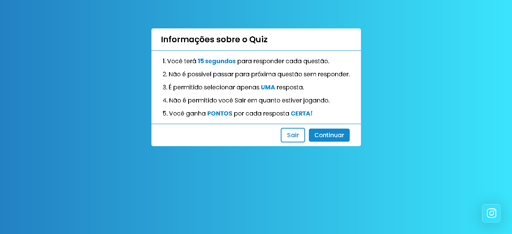

<h1 align="center">
 QUIZ PAGE
</h1>

## Participantes

[Sammynauta](https://github.com/Sammynauta)

# Sobre o Projeto

- Objetivo foi poder aumentar meu aprendizado em Javascript, melhorando minha lógica de programação e colacando em prática meus conhecimentos sobre a Linguagem.

 

1. Criar um QUIZ simples em que o usuário possa interagir.
2. deverá ter um CARD de informações antes do inicio do jogo.
3. o usuário poderá escolher uma entre quatro alternativas.
4. o QUIZ deverá tem um tempo de 15 segundos para cada resposta.
5. ter botões de sair e reiniciar o QUIZ.
6. ter pontuação do usuário ao finial do QUIZ.
7. Deverá se adequar ao tamanho de tela.

## Recursos

- [x] HTML, CSS, JS
- [x] GOOGLE FONTS
- [x] FONTAWESOME

## Iniciar o Projeto no VSCODE

1. Abra a pasta no `VSCode`
2. Instale `Live Server` se quiser suas mudanças em tempo real.
3. clique com o botao direoto `index.html` > `Open with Live Server`.